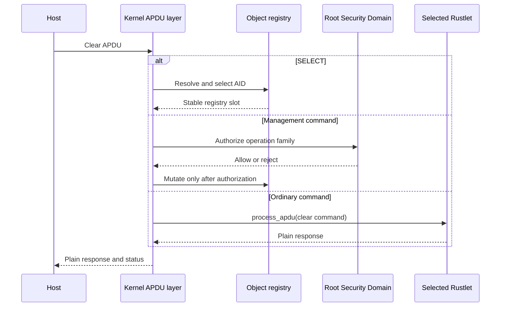
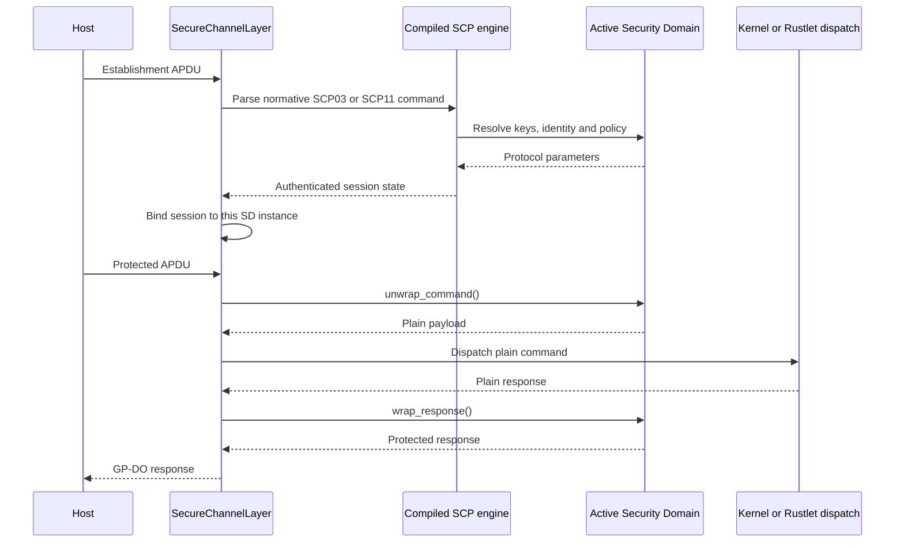
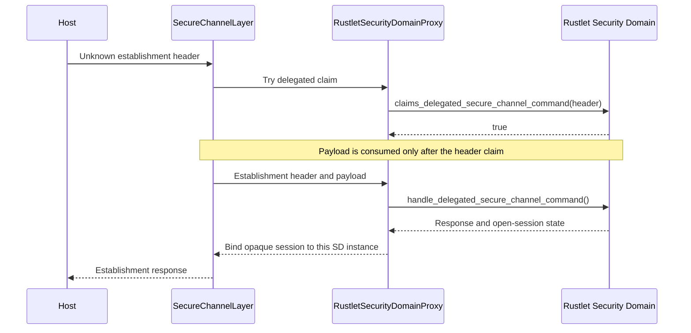
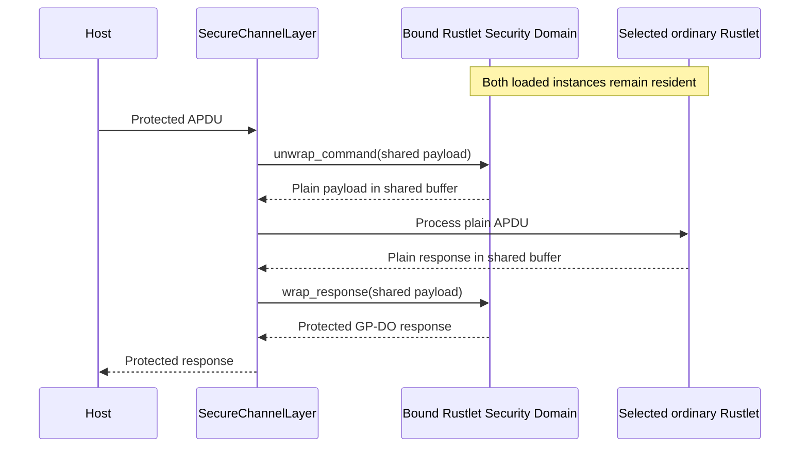

# Security Domain Developer Guide

This guide describes the current developer-facing model for a Rustlet-backed
Security Domain in Oxide SE.

The model adopted by Oxide SE is that Security Domains are themselves managed
objects recorded in the same global registry as other resident objects. They
are not tracked in a separate side registry.

## First Principle

A Security Domain is, first of all, a Rustlet.

That means:

- it is a `no_std`, `no_main` FAE payload;
- it is declared through the Rustlet runtime;
- it may be selected like another resident application;
- it may implement normal Rustlet APDU processing through `process_apdu()`.

Then, in addition, it exposes a dedicated administrative interface to the
kernel.

So the right mental model is:

- ordinary Rustlet role: the Security Domain can answer ordinary APDUs sent to
  its own instance;
- administrative role: the kernel can call it as an authority through the
  Security Domain framework.

Each Security Domain instance is therefore both:

- an application-like object identified by an instance AID;
- an administrative authority attached to a place in the Security Domain
  hierarchy.

## Declaring A Security Domain

The dedicated declaration macro is:

```rust
declare_security_domain!(MySecurityDomain);
declare_security_domain!(MySecurityDomain, 2048usize);
declare_security_domain!(MySecurityDomain, 2048usize, install_custom);
```

The concrete type must implement:

- `Rustlet`
- `RustletSecurityDomain`

The macro exports:

- the normal Rustlet runtime entry point;
- the additional Security Domain dispatch entry used by the kernel proxy.

## Two Interfaces, One Object

The two current interfaces are:

- `Rustlet`, documented in
  [rt.rs](../rustlets/rustlet_runtime/src/rt.rs)
- `RustletSecurityDomain`, documented in
  [security_domain.rs](../rustlets/rustlet_runtime/src/security_domain.rs)

This split is intentional.

`Rustlet::process_apdu()` expresses:

- how the Security Domain behaves when it is selected and receives ordinary
  APDUs as an application.

`RustletSecurityDomain` expresses:

- how the Security Domain participates in management authority;
- how it advertises its GlobalPlatform discovery data;
- how it exposes secure-channel services;
- how it performs secure messaging transforms for protected APDUs.

## APDU Processing Flow

Every command first enters the kernel-owned T=0 and APDU layers. The kernel
parses the transport header, bounds the incoming payload, and resolves an
administrative authority before invoking either an application or a Security
Domain backend.

### Clear Commands

When no secure channel protects the command:

1. `SELECT` is interpreted by the kernel because it changes the selected
   registry object.
2. A clear management command is interpreted under the root Security Domain.
3. `NullSecurityDomain` may explicitly allow out-of-channel development
   management.
4. `KernelSecurityDomain` and `RustletSecurityDomainProxy` reject mutating
   top-level management in clear.
5. An ordinary non-management APDU is delivered to the selected Rustlet through
   `Rustlet::process_apdu()`.

There is therefore always an authority for a management command, even when no
supplementary Security Domain has been selected: it is the root Security
Domain declared by the build manifest.

### Kernel-Supported Secure Channels

If the build enables the establishment protocol identified by the APDU:

1. the kernel selects its SCP03 or SCP11 establishment parser;
2. the Security Domain backend supplies keys, identity, state, and policy;
3. successful authentication binds the session to that exact Security Domain
   instance;
4. each protected command is authenticated and decrypted before management or
   ordinary application dispatch;
5. the plain response is encrypted and authenticated according to the selected
   security level.

For a Rustlet-backed Security Domain, steps 2, 4, and 5 cross the `sddispatch`
framework ABI. The kernel still applies the compiled protocol's
non-overridable security-level and management-family matrix.

### Protocols Delegated To A Rustlet Security Domain

If the kernel build does not include the protocol:

1. the proxy passes the unconsumed command header to
   `claims_delegated_secure_channel_command()`;
2. a positive claim transfers that establishment APDU to
   `handle_delegated_secure_channel_command()`;
3. a successful exchange binds an opaque delegated session to the claiming
   Security Domain instance;
4. subsequent protected APDUs use that instance's `unwrap_command()` and
   `wrap_response()` implementations.

The claim is header-only so that rejected candidates cannot consume or alter
the command payload. A protocol compiled into the kernel always takes
precedence over a Rustlet claim. The delegated Security Domain owns the
unknown protocol's cryptographic state and protocol-specific policy, while the
kernel retains registry ancestry, lifecycle, base privilege, APDU-bound, and
operation-family checks.

### Flow 1: Clear APDU Without A Session



### Flow 2: Protocol Compiled Into The Kernel



### Flow 3: Protocol Delegated To A Rustlet Security Domain



### Flow 4: Protected Command To An Ordinary Rustlet



## What A Security Domain Must Usually Manage

According to the current GlobalPlatform-inspired model used by Oxide SE, a
Security Domain typically covers the following blocks.

Before looking at these blocks, one structural rule matters:

- every managed object, including a Security Domain instance, is recorded in the
  global registry;
- every such object may carry a `parent_sd_aid`;
- `parent_sd_aid = None` means the object belongs directly to the top-level
  administrative space;
- a Security Domain instance with no `parent_sd_aid` is a root-level Security
  Domain instance;
- the bootstrap administrative authority is defined as the first such Security
  Domain instance seeded by the kernel.

This is the registry-side representation of the Security Domain hierarchy.

In practice, the registry is also the active visibility boundary:

- ordinary lookups are resolved from the point of view of the Security Domain
  instance currently selected for the active secure channel;
- a managed object outside that visible sub-tree is treated as absent from that
  administrative context;
- hierarchy checks therefore live first in registry access, not as ad hoc
  guards spread across unrelated management code.

Top-level creation policy is intentionally strict:

- `NullSecurityDomain` is the only profile that accepts clear top-level
  management for development images;
- `KernelSecurityDomain` and `RustletSecurityDomainProxy` reject top-level
  object creation outside an authenticated secure channel;
- supplementary Security Domains create descendants under their own authority,
  not new unmanaged top-level objects;
- there is no hidden production switch that enables unmanaged top-level
  creation. A manufacturing profile would have to be explicit and auditable.

### 1. Application-Like Behavior

A Security Domain is addressable as an application-like resident object.

In practice this means:

- it may need to answer `SELECT`;
- it may expose FCI or identification data;
- it may expose administrative APDUs through its own `process_apdu()`.

Current Oxide SE support:

- implemented through normal `Rustlet::process_apdu()`;
- implemented through the typed APDU API from
  [apdu.rs](../rustlets/rustlet_runtime/src/apdu.rs).

Example in the reference Rustlet Security Domain:

- [main.rs](../rustlets/complete_security_domain/src/main.rs)
- [main.rs](../rustlets/simple_security_domain/src/main.rs)

### 2. Management Authority

This is the first dedicated Security Domain block.

The kernel remains the owner of:

- APDU parsing;
- the global AID registry;
- install/load/delete mechanics;
- object routing.

The Security Domain contributes:

- authorization;
- privilege decisions;
- management-scoped data;
- policy decisions such as “may this SD manage that instance?”

The current Rustlet-side hooks are:

- `install_for_load(...)`
- `install_for_install(...)`
- `delete_aid(...)`
- `get_data(...)`
- `put_key(...)`
- `store_data(...)`
- `set_status(...)`
- `may_manage_applet(...)`
- `may_make_selectable(...)`

Current support status:

- implemented in the runtime framework;
- routed through the kernel `sddispatch` bridge;
- exercised at least partially by the current test path;
- backed by a common runtime privilege type that decodes the first
  GlobalPlatform privilege byte carried by `INSTALL [for install]`;
- stored in the standard persistent administrative state of the Security
  Domain instance rather than as ad hoc booleans inside the Rustlet itself;
- enforced first by the kernel proxy: with the current privilege model, a
  Security Domain instance cannot grant privilege bits it does not already
  hold, and the Rustlet hook is only reached for further refinement.

Important architectural point:

- the Security Domain does not own the global registry;
- the Security Domain does not decide its deployed AID;
- the root/non-root role is not chosen by the Rustlet itself;
- the `parent_sd_aid` association is not chosen by the Rustlet itself.

Those are kernel-side deployment decisions.

#### Object Registry Responsibilities

From the developer point of view, it is useful to separate two ideas:

- the kernel global registry, which is the real routing database;
- the Security Domain's own policy view over managed objects.

In that registry model:

- ordinary applications, load files, and Security Domains are all registry
  objects;
- the object relation to administration is expressed by `parent_sd_aid`;
- a supplementary Security Domain is therefore represented as an object whose
  parent is another Security Domain;
- delegated authority is expected to follow that hierarchy together with the
  privilege bitfield.

Current framework support:

- `may_manage_applet(...)`
- `may_make_selectable(...)`
- management authorization hooks
- `SecurityDomainPrivileges`, which currently interprets the full first
  privilege byte and preserves bytes 2 and 3 as raw encoded state.

Not yet implemented:

- a dedicated Rustlet-side object catalogue abstraction beyond those hooks;
- user-land ownership views richer than the current AID-based checks;
- interpretation of privilege bytes 2 and 3;
- a full GP delegated-management object model.

### 3. Administrative Data

A Security Domain must usually answer management data queries.

The main current hook is:

- `get_data(tag, out)`

This is how the Security Domain contributes data for GP-style `GET DATA`.
The runtime default handles:

- `0066`, Card Recognition Data, derived from the protocol-support hooks;
- `0067`, Card Capability Information, when at least one protocol is
  advertised;
- `9F70`, the lifecycle object from runtime-managed administrative state.

The protocol-support hooks used by discovery are:

- `supports_scp03_s8()`
- `supports_scp03_s16()`
- `supports_scp11a()`
- `supports_scp11b()`
- `supports_scp11c()`

This coupling is deliberate: a Rustlet Security Domain cannot accidentally
advertise a kernel-only protocol. If all support hooks return `false`, `0066`
remains a valid GP recognition structure without an SCP declaration and
`0067` returns `6A88`.

Current support status:

- implemented;
- wired through `sddispatch`;
- used for lifecycle and standards-compliant secure-channel discovery.

`GET STATUS` does not expose a second Rustlet-side catalogue hook. The kernel
owns the global registry and emits the visible package, application, and
Security Domain records itself. The Rustlet Security Domain contributes
authorization and its persisted privilege/lifecycle state; keys and private
data objects are not enumerated.

### 4. Secure Channel Establishment

This block is about opening and tracking SCP03 or SCP11 sessions, or claiming
an establishment protocol absent from the kernel build.

The current hooks are:

- `supports_scp03()`
- `supports_scp03_s8()`
- `supports_scp03_s16()`
- `supports_scp11a()`
- `supports_scp11b()`
- `supports_scp11c()`
- `initialize_update(ctx, command, out)`
- `external_authenticate(ctx, command)`
- `scp11_stage_oce_certificate(ctx, command)`
- `scp11a_mutual_authenticate(ctx, command, out)`
- `scp11b_internal_authenticate(ctx, command, out)`
- `scp11c_mutual_authenticate(ctx, command, out)`
- `claims_delegated_secure_channel_command(header)`
- `handle_delegated_secure_channel_command(ctx, command, out)`
- `current_security_level()`
- `secure_channel_open()`
- `current_mac_len()`
- `reset_secure_channel()`

The smallest delegated SCP03 claim should match only the establishment headers
owned by the Rustlet:

```rust
fn claims_delegated_secure_channel_command(
    &self,
    header: DelegatedSecureChannelHeader,
) -> bool {
    matches!(
        (header.cla, header.ins, header.p2),
        (0x80, 0x50, _) | (0x84, 0x82, 0x00)
    )
}
```

The default `handle_delegated_secure_channel_command()` implementation then
adapts `INS=50` to `initialize_update()` and `INS=82` to
`external_authenticate()`. A supplementary protocol overrides that method
instead:

```rust
fn handle_delegated_secure_channel_command(
    &mut self,
    ctx: &mut RustletCtx,
    command: &DelegatedSecureChannelCommand<'_>,
    out: &mut [u8],
) -> Result<usize, ApduStatus> {
    match command.header.ins {
        0x50 => self.initialize_update(
            ctx,
            &InitializeUpdate {
                key_version: command.header.p1,
                key_id: command.header.p2,
                host_challenge: command.data,
            },
            out,
        ),
        0x82 if command.header.p2 == 0x00 => {
            self.external_authenticate(
                ctx,
                &ExternalAuthenticate {
                    cla: command.header.cla,
                    security_level: SecurityLevel::from_bits(command.header.p1),
                    p2: command.header.p2,
                    authentication_data: command.data,
                },
            )?;
            Ok(0)
        }
        _ => Err(ApduStatus::instruction_not_supported()),
    }
}
```

This is the actual default adapter from `rustlet_runtime`: it converts the
borrowed delegated command into the two operation-oriented SCP03 views without
copying its payload.

The reference `initialize_update()` then validates the challenge/profile,
resolves the requested keyset, derives the session material and publishes the
card response directly in `out`:

```rust
fn initialize_update(
    &mut self,
    ctx: &mut RustletCtx,
    command: &InitializeUpdate<'_>,
    out: &mut [u8],
) -> Result<usize, ApduStatus> {
    let Some(profile) = profile_from_challenge_len(command.host_challenge.len()) else {
        return Err(ApduStatus::wrong_length());
    };
    let (key_version, key_id) =
        resolve_requested_keyset(command.key_version, command.key_id);
    let challenge_len = profile.challenge_len();
    let cryptogram_len = profile.cryptogram_len();
    let card_challenge = profile.card_challenge();
    let (
        card_cryptogram,
        host_cryptogram,
        session_enc_key,
        session_mac_key,
        session_rmac_key,
    ) = derive_scp03_material(
        ctx,
        profile,
        command.host_challenge,
        card_challenge,
        key_version,
        key_id,
    )?;

    let response_len = 12 + challenge_len + cryptogram_len;
    if out.len() < response_len {
        return Err(ApduStatus::wrong_length());
    }
    out[..response_len].fill(0);
    out[10] = key_version;
    out[11] = key_id;
    out[12..12 + challenge_len].copy_from_slice(card_challenge);
    out[12 + challenge_len..response_len]
        .copy_from_slice(&card_cryptogram[..cryptogram_len]);

    self.secure_channel.scp03_state = SCP03_STATE_INITIALIZED;
    self.secure_channel.scp03_profile = profile.id();
    self.secure_channel.scp03_security_level_bits = SecurityLevel::NONE.bits();
    self.secure_channel.scp03_expected_host_cryptogram = [0; SCP03_MAX_CRYPTOGRAM_LEN];
    self.secure_channel.scp03_expected_host_cryptogram[..cryptogram_len]
        .copy_from_slice(&host_cryptogram[..cryptogram_len]);
    self.secure_channel.scp03_session_enc_key = session_enc_key;
    self.secure_channel.scp03_session_mac_key = session_mac_key;
    self.secure_channel.scp03_session_rmac_key = session_rmac_key;
    self.secure_channel.scp03_command_mac_chain = [0; 16];
    self.secure_channel.scp03_response_mac_chain = [0; 16];
    self.secure_channel.scp03_command_enc_counter = 0;
    self.secure_channel.scp03_response_enc_counter = 0;
    Ok(response_len)
}
```

`external_authenticate()` must authenticate both the host cryptogram and the
mandatory C-MAC before making the session visible as open:

```rust
fn external_authenticate(
    &mut self,
    ctx: &mut RustletCtx,
    command: &ExternalAuthenticate<'_>,
) -> Result<SecurityLevel, ApduStatus> {
    let Some(profile) = self.profile() else {
        return Err(ApduStatus::conditions_not_satisfied());
    };
    if self.secure_channel.scp03_state != SCP03_STATE_INITIALIZED {
        return Err(ApduStatus::conditions_not_satisfied());
    }

    let security_level = command.security_level;
    if !is_supported_security_level(security_level) {
        return Err(ApduStatus::wrong_data());
    }
    let cryptogram_len = profile.cryptogram_len();
    let mac_len = profile.mac_len();
    let expected_data_len = cryptogram_len
        .checked_add(mac_len)
        .ok_or_else(ApduStatus::wrong_length)?;
    if command.cla != 0x84
        || command.p2 != 0x00
        || command.authentication_data.len() != expected_data_len
    {
        return Err(ApduStatus::wrong_length());
    }

    let (host_cryptogram, received_mac) =
        command.authentication_data.split_at(cryptogram_len);
    let header = [
        command.cla,
        0x82,
        security_level.bits(),
        command.p2,
        expected_data_len as u8,
    ];
    let initial_mac_chain = compute_external_authenticate_cmac(
        ctx,
        &self.secure_channel.scp03_session_mac_key,
        &header,
        host_cryptogram,
    )?;
    if !constant_time_eq(
        host_cryptogram,
        &self.secure_channel.scp03_expected_host_cryptogram[..cryptogram_len],
    ) || !constant_time_eq(received_mac, &initial_mac_chain[..mac_len])
    {
        return Err(ApduStatus::authentication_failed());
    }

    self.secure_channel.scp03_security_level_bits = security_level.bits();
    self.secure_channel.scp03_state = SCP03_STATE_AUTHENTICATED;
    self.secure_channel.scp03_command_mac_chain = initial_mac_chain;
    self.secure_channel.scp03_response_mac_chain = initial_mac_chain;
    Ok(security_level)
}
```

The names of the compact state enum and helper structure may differ in another
Security Domain, but the transition order is invariant: no authenticated state
is published before both checks succeed. The session-reporting methods derive
their answers from this live state:

```rust
fn secure_channel_open(&self) -> bool {
    self.secure_channel.scp03_state == SCP03_STATE_AUTHENTICATED
}

fn current_security_level(&self) -> SecurityLevel {
    SecurityLevel::from_bits(self.secure_channel.scp03_security_level_bits)
}

fn current_mac_len(&self) -> usize {
    if self.secure_channel_open() {
        self.profile().map(|profile| profile.mac_len()).unwrap_or(0)
    } else {
        0
    }
}

fn reset_secure_channel(&mut self) {
    self.clear_secure_channel_state();
}
```

Depending on the selected architecture, this block is where the Security
Domain owns or supplies:

- session state;
- active protocol and profile;
- derived session keys;
- security level;
- host/card authentication state;
- MAC length policy.

The intended platform rule is:

- a secure-channel session is associated with one Security Domain instance and
  one logical channel;
- the selected Security Domain instance for that channel is the authority that
  answers SCP03 `INITIALIZE UPDATE` / `EXTERNAL AUTHENTICATE`, SCP11
  establishment commands, and later secure-messaging transforms;
- if no channel exists yet, only top-level objects with `parent_sd_aid = None`
  may be selected.

Secure-channel ownership does not let the backend widen GlobalPlatform
authorization. Before invoking a management hook, the kernel applies the
non-overridable profile matrix: SCP03 and owner-authenticated SCP11a expose the
implemented management families; SCP11b is read-only because it authenticates
the card but not the OCE; and SCP11c rejects `PUT KEY`, `SET STATUS`, and key
deletion even for its owner-authenticated form. The current SCP11c `ANY_AUTH`
profile accepts only `GET DATA` because `BF20` authorization is profiled out.

The corresponding Rustlet hook is nevertheless called for every command that
passes this base gate. A Rustlet Security Domain may therefore reject an
otherwise permitted operation according to its own state, certificate policy,
or finer privileges, but it cannot authorize an operation forbidden by the
selected SCP profile. No mutable authorization result is cached between
commands.

That non-escalation rule applies to protocols selected in the kernel build.
When the manifest does not enable a protocol, the kernel does not invent a
profile matrix for it. A Rustlet Security Domain may instead claim an
establishment header with `claims_delegated_secure_channel_command()` and
process it with `handle_delegated_secure_channel_command()`. A successful
exchange binds an opaque delegated session to that exact Security Domain
instance. The Rustlet then owns its cryptographic state and protocol-specific
management policy, while the proxy continues to enforce object ancestry,
kernel-owned privilege bits, lifecycle restrictions, APDU bounds, and the
ordinary operation-family hooks. A compiled kernel protocol always takes
precedence over a Rustlet claim.

`complete_security_domain` demonstrates this extension model with SCP03. The
configuration
`configs/config_rustlet_security_domain_delegated_scp03_test.toml`
declares no kernel secure-channel protocol, yet the Rustlet Security Domain
claims and completes the existing SCP03 campaign. The same boundary is intended
for future supplementary protocols that retain the GlobalPlatform APDU and
GP-DO transport contract.

Current support status:

- implemented in the framework;
- routed through the kernel proxy;
- implemented in `complete_security_domain`;
- validated in QEMU for `S8` and `S16`.

Current crypto support used by the Security Domain:

- `ctx.crypto()`
- typed `Cipher`
- typed `Mac`
- random generation if needed

The following helper is copied from `complete_security_domain`. It shows the
intended ownership pattern for `ctx.crypto()`: the provider and typed MAC live
only for the current call, accept borrowed input fragments, and return one
owned fixed-size tag:

```rust
fn compute_chained_cmac(
    ctx: &mut RustletCtx,
    key: &[u8; 16],
    chain: &[u8; 16],
    input: &[u8],
) -> Result<[u8; 16], ApduStatus> {
    let mut provider = ctx.crypto();
    let mut mac = Mac::<Uninitialized>::new(&mut provider)
        .init(key, MacAlgorithm::AesCmac)
        .map_err(crypto_error_to_status)?;
    mac.update(chain).map_err(crypto_error_to_status)?;
    mac.update(input).map_err(crypto_error_to_status)?;
    let tag = mac.compute().map_err(crypto_error_to_status)?;
    let mut out = [0u8; 16];
    out.copy_from_slice(tag.as_ref());
    Ok(out)
}
```

The same pattern applies to `Cipher`: initialize it with a provider borrowed
from the current `RustletCtx`, finish directly into the caller-provided `out`
slice, and do not store the provider, cipher, input slice, or output slice in
the Security Domain state.

This is the current intended architecture: a Rustlet-backed Security Domain may
implement its secure-channel crypto in user-land while using kernel-mediated
crypto primitives.

#### Persistent State Versus Volatile Session State

Application-owned persistent state and secure-channel session state have
different lifetimes and must be represented separately.

The runtime deserializes a Rustlet Security Domain when its FAE instance is
loaded. The in-memory Rust value then remains alive while that Security Domain
is loaded. The kernel keeps the active Rustlet Security Domain resident in a
dedicated slot while an ordinary selected Rustlet occupies the application
slot. Secure messaging therefore keeps one live Security Domain instance
across `unwrap` and `wrap`. An ordinary selected Rustlet is different: it is
reconstructed from serialized state for its dispatch and its heap is scrubbed
afterward. The runtime serializes the Security Domain's persistent view after
each successful `sddispatch` call, but does **not** deserialize that Security
Domain object before every APDU.

Consequently, session keys must not be made persistent merely to keep a session
alive. The reference implementation uses:

```rust
#[derive(Default, Serialize, Deserialize)]
struct CompleteSecurityDomain {
    #[serde(skip)]
    secure_channel: VolatileSecureChannelState,
}

#[derive(Default)]
struct VolatileSecureChannelState {
    // Session keys, expected cryptograms, MAC chains and counters.
}
```

The runtime wrapper separately persists the Security Domain lifecycle and
three-byte privilege field. A production Security Domain may add its own
persistent configuration fields alongside `secure_channel`, but the following
values must remain under `#[serde(skip)]`:

- derived SCP03/SCP11 session keys;
- expected or received session cryptograms and receipts;
- command and response MAC chains;
- encryption counters;
- partially staged SCP11 establishment buffers;
- any temporary authenticated or decrypted APDU fragment.

On unload, reset, reboot, or a later reload, the skipped field is reconstructed
with `Default`, so no previous session is resumed. Older Postcard encodings that
contained trailing session fields are accepted by the current decoder, but
those trailing bytes are ignored and the volatile field remains at `Default`.

This does not make `reset_secure_channel()` optional. The kernel invokes reset
when an authenticated session must end while the Security Domain remains
loaded, including a new establishment exchange, a protocol-defined terminating
condition, or a clear command that invalidates the active profile. Reset must
overwrite the volatile structure immediately. Waiting for unload would leave
live secrets and an apparently open session in RAM.

The separation also preserves the power-loss invariant: persistent
administrative or application mutations continue to be serialized after each
successful call, rather than waiting for a `DESELECT` that may never occur.

Failure paths follow these rules:

- a malformed establishment APDU is rejected before a session becomes open;
- a second establishment starts from a reset session and never inherits old
  chains or counters;
- a bad host cryptogram, receipt, command MAC, or replayed chain value is
  rejected and must not advance the authenticated state;
- an ordinary clear command that terminates the selected SCP profile triggers
  reset before clear dispatch is considered;
- a Rustlet fault does not publish returned state bytes as a successful
  mutation; kernel fault recovery closes the affected execution path;
- reset overwrites all derived keys, chains, counters, cryptograms, receipts,
  and staged handshake fragments, even though none of them are serialized.

### 5. Secure Messaging

This block covers protected command and response transforms after the secure
channel has been opened.

The current hooks are:

- `unwrap_command(ctx, command, out)`
- `wrap_response(ctx, response, out)`

Their implementation shape is intentionally in-place:

```rust
fn unwrap_command(
    &mut self,
    ctx: &mut RustletCtx,
    command: &WrappedCommand<'_>,
    out: &mut [u8],
) -> Result<usize, ApduStatus> {
    let Some(profile) = self.profile() else {
        return Err(ApduStatus::conditions_not_satisfied());
    };
    if !self.secure_channel_open()
        || !uses_command_mac(self.current_security_level())
        || command.mac.len() != profile.mac_len()
    {
        return Err(ApduStatus::conditions_not_satisfied());
    }

    let chain = compute_chained_cmac(
        ctx,
        &self.secure_channel.scp03_session_mac_key,
        &self.secure_channel.scp03_command_mac_chain,
        command.authenticated,
    )?;
    if !constant_time_eq(command.mac, &chain[..profile.mac_len()]) {
        return Err(ApduStatus::conditions_not_satisfied());
    }
    self.secure_channel.scp03_command_mac_chain = chain;

    if uses_command_encryption(self.current_security_level()) {
        if command.data.is_empty() {
            return Ok(0);
        }
        let iv = next_encryption_iv(
            ctx,
            &self.secure_channel.scp03_session_enc_key,
            &mut self.secure_channel.scp03_command_enc_counter,
            SCP03_DIRECTION_COMMAND,
        )?;
        decrypt_iso9797_m2(
            ctx,
            &self.secure_channel.scp03_session_enc_key,
            &iv,
            command.data,
            out,
        )
    } else {
        if command.data.len() > out.len() {
            return Err(ApduStatus::wrong_length());
        }
        out[..command.data.len()].copy_from_slice(command.data);
        Ok(command.data.len())
    }
}

fn wrap_response(
    &mut self,
    ctx: &mut RustletCtx,
    response: &PlainResponse<'_>,
    out: &mut [u8],
) -> Result<usize, ApduStatus> {
    let Some(profile) = self.profile() else {
        return Err(ApduStatus::conditions_not_satisfied());
    };
    if !self.secure_channel_open() || !uses_response_mac(self.current_security_level()) {
        return Err(ApduStatus::conditions_not_satisfied());
    }

    let data_offset = 4;
    let payload_len = if uses_response_encryption(self.current_security_level())
        && !response.data.is_empty()
    {
        let iv = next_encryption_iv(
            ctx,
            &self.secure_channel.scp03_session_enc_key,
            &mut self.secure_channel.scp03_response_enc_counter,
            SCP03_DIRECTION_RESPONSE,
        )?;
        encrypt_iso9797_m2(
            ctx,
            &self.secure_channel.scp03_session_enc_key,
            &iv,
            response.data,
            &mut out[data_offset..],
        )?
    } else {
        let end = data_offset
            .checked_add(response.data.len())
            .ok_or_else(ApduStatus::wrong_length)?;
        if end > out.len() {
            return Err(ApduStatus::wrong_length());
        }
        out[data_offset..end].copy_from_slice(response.data);
        response.data.len()
    };

    let mac_offset = data_offset
        .checked_add(payload_len)
        .ok_or_else(ApduStatus::wrong_length)?;
    let total_len = mac_offset
        .checked_add(profile.mac_len())
        .ok_or_else(ApduStatus::wrong_length)?;
    if total_len > out.len() {
        return Err(ApduStatus::wrong_length());
    }
    let mut mac_input = [0u8; SCP03_WRAP_RESPONSE_MAC_INPUT_CAPACITY];
    let mac_input_len = encode_gp_do_mac_input(
        &out[data_offset..data_offset + payload_len],
        response.status,
        &mut mac_input,
    )?;
    let chain = compute_chained_cmac(
        ctx,
        &self.secure_channel.scp03_session_rmac_key,
        &self.secure_channel.scp03_response_mac_chain,
        &mac_input[..mac_input_len],
    )?;
    self.secure_channel.scp03_response_mac_chain = chain;

    out[0] = ((payload_len >> 8) & 0xff) as u8;
    out[1] = (payload_len & 0xff) as u8;
    out[2] = 0;
    out[3] = profile.mac_len() as u8;
    out[mac_offset..total_len].copy_from_slice(&chain[..profile.mac_len()]);
    Ok(total_len)
}
```

`command` and `response` are borrowed views valid only for the current call.
The returned length is the sole publication boundary for bytes written to
`out`.

This is where the Security Domain handles:

- command MAC verification;
- response MAC production;
- command decryption;
- response encryption;
- command and response chaining state.

`WrappedCommand` and `PlainResponse` are borrowed views. The `out` slice is the
kernel-provided shared APDU workspace, not Rustlet-owned persistent memory.
Implementations must:

- validate the complete protected structure before accepting the command;
- write the resulting plain command or protected response directly to `out`;
- return only the number of valid bytes;
- retain only session state, never a borrowed slice or pointer;
- avoid copying the APDU into serialized Security Domain state.

The kernel invokes the Rustlet with the secondary shared buffer in a
cryptographic-workspace typestate. Before an ordinary Rustlet ABI call, that
workspace is cleared and transformed into the serialized-state/context
typestate. This prevents cryptographic intermediates from being interpreted as
application state and keeps the transform path bounded without stack-sized
APDU copies.

Current support status:

- implemented in the framework;
- routed through the kernel proxy;
- implemented in `complete_security_domain`;
- validated in QEMU for:
  - `C-MAC/R-MAC`
  - `C-ENC/R-ENC`
  - `S8`
  - `S16`

### 6. Privileges And Policy

The Security Domain exposes its privilege view through:

- `privileges()`

This is the current place to report the authority carried by the Security
Domain object.

Current support status:

- implemented at framework level;
- the runtime decodes the complete first GlobalPlatform privilege byte:
  - Security Domain
  - DAP Verification
  - Delegated Management
  - Card Lock
  - Card Terminate
  - Card Reset
  - CVM Management
  - Mandated DAP Verification
- the default implementations of:
  - `install_for_load(...)`
  - `install_for_install(...)`
  - `delete_aid(...)`
  - `put_key(...)`
  - `store_data(...)`
  - `set_status(...)`
  - `may_manage_applet(...)`
  - `may_make_selectable(...)`
  derive conservative management defaults from that decoded privilege
  state, while the kernel proxy remains the authoritative gate for the
  base privilege check;
- this privilege state is persisted as part of the standard Security Domain
  runtime wrapper, together with a minimal lifecycle field;
- `INSTALL [for install and make selectable]` currently initializes that
  lifecycle to `Selectable`;
- `GET DATA 9F70` is served from that standard runtime-managed
  administrative state;
- during bootstrap, the kernel creates one implicit root Security Domain
  instance and grants that bootstrap instance the complete administrative
  privilege set currently modeled by the platform.

The hierarchy rule is equally important:

- an instance may only create descendant Security Domain instances or managed
  objects under its own authority;
- an already existing managed object may only be selected, managed, or deleted
  when it lies in the active Security Domain instance sub-tree;
- a newly created managed object is recorded with the current active Security
  Domain instance as its `parent_sd_aid`;
- privilege transfer is monotonic: a child instance cannot receive more rights
  than its parent instance already holds;
- the kernel or proxy layer enforces this base non-escalation rule before any
  Rustlet hook can refine the decision.

Not yet implemented:

- interpretation of the second and third GlobalPlatform privilege bytes;
- a complete GP privilege matrix enforced everywhere;
- a complete delegated-management policy model;
- richer lifecycle-dependent privilege variations.

### 7. Keys And Key Management

A real GP Security Domain also owns key material and associated policy.

In practice this means:

- static SCP03 keysets;
- key versions;
- key identifiers;
- key rotation;
- diversification;
- `PUT KEY`-style management.

Current support status:

- SCP03 static keysets are stored as typed registry objects attached to one
  owning Security Domain instance through `parent_sd_aid`;
- the current ancillary object kind is a SCP03 static key object, identified by
  `(key_version, key_id, usage)` and carrying raw AES-128 material plus one
  explicit key state;
- initial key objects are declared under `[[root.keys]]` or
  `[[security_domains.keys]]` in the build manifest; the bootstrap path inserts
  exactly those objects and never invents fallback SCP03 keys;
- `PUT KEY` is implemented in the kernel management path and stores those key
  objects under the active Security Domain instance;
- the `PUT KEY` P1/P2 control bytes are decoded according to the
  GlobalPlatform layout: P1 carries the Key Version Number plus the
  last-command bit, while P2 carries the first Key Identifier plus the
  single/multiple-key bit;
- kernel-native SCP03 resolves its static communication keys from that
  registry state before `INITIALIZE UPDATE`;
- Rustlet-backed Security Domains reached through
  `RustletSecurityDomainProxy` load the same SCP03 static key objects through
  runtime syscalls, so `INITIALIZE UPDATE` is also resolved from the registry
  in user-land;
- identical `(key_version, key_id, usage)` tuples may exist in different
  Security Domain subtrees, because these key objects are parent-qualified
  resources rather than process-global key slots.

The currently implemented `PUT KEY` subset is intentionally small but follows
the GP keyset identity model:

- `P1 & 0x7F` carries the key version;
- `P1 & 0x80` carries the GP last-command flag for chained key loading;
- `P2 & 0x7F` carries the first key identifier;
- `P2 & 0x80` indicates that several keys are carried by the same APDU;
- when the multiple-key bit is set, subsequent payload entries are stored under
  incrementing key identifiers;
- the command payload is a concatenation of entries
  `(usage, key_len, key_bytes)`;
- supported usages are currently SCP03 static `ENC` and `MAC`;
- supported key length is currently AES-128 only;
- a new `PUT KEY` for an existing `(owner, key_version, key_id, usage)` tuple
  replaces the previous material and keeps the key object `Active`;
- retired key objects remain in the registry but are ignored by SCP03 session
  derivation;
- deletion helpers operate on the same owner-qualified tuple, so deleting one
  key usage does not affect a sibling Security Domain or another usage in the
  same keyset.

Remaining work in this area:

- GP key purpose / key usage qualifier policy for newer Card Specification
  profiles;
- key diversification and key encryption key handling;
- final policy for first-key provisioning of supplementary Security Domain
  instances;
- richer public key-information templates for `GET DATA`;
- APDU-level `DELETE [key]` coverage beyond the current registry helper.

## Current Framework Mapping

The current mapping is:

- ordinary APDUs to the SD itself:
  `Rustlet::process_apdu()`
- management authority calls from the kernel:
  `RustletSecurityDomain` management hooks
- SCP03 session calls from the kernel:
  `RustletSecurityDomain` secure-channel hooks
- protected APDU transforms from the kernel:
  `RustletSecurityDomain` secure-messaging hooks

The bridge between kernel and Rustlet Security Domain is the dedicated
framework call usually referred to as `sddispatch`.

This is not a wire APDU.

It is a kernel-to-Rustlet framework ABI used to invoke the selected Security
Domain instance directly.

That invocation always happens in the context of one selected Security Domain
instance. The framework call is therefore not “call the Security Domain type”,
but “call this concrete Security Domain instance recorded in the registry”.

## Current Reference Implementation

The current reference Rustlet Security Domain is:

- [main.rs](../rustlets/complete_security_domain/src/main.rs)

It currently demonstrates:

- normal selectable Rustlet behavior;
- management hook implementation;
- user-land SCP03 session establishment;
- user-land SCP03 secure messaging;
- `S8` and `S16` support;
- registry-backed SCP03 key loading;
- per-instance SCP03 keyset isolation through `PUT KEY`.

It should be read as a bring-up reference, not yet as a full production GP
Security Domain.

## Current Test Path

The current end-to-end SCP03 validation path is:

- `cargo run test gp_rustlet_security_domain_scp03 mps2-an385`

A kernel with no compiled secure-channel protocol is validated with:

- `cargo run test gp_rustlet_security_domain_delegated_scp03 mps2-an385`

The Rustlet-backed SCP11 paths are validated separately with:

- `cargo run test gp_rustlet_security_domain_scp11a mps2-an385`
- `cargo run test gp_rustlet_security_domain_scp11b mps2-an385`
- `cargo run test gp_rustlet_security_domain_scp11c mps2-an385`

For those paths, the kernel proxy validates the common SCP11 CRT grammar and
passes operation-oriented parameters to the Rustlet Security Domain. The
Rustlet receives the requested ECKA key version/identifier and the
identity-in-KDF flag, then resolves them against its own key and identity
configuration. Only Host ID originates in tag `84`; SIN/SDIN and Card Group ID
must remain Security-Domain-owned values. PSO command fragments are reassembled
by the kernel before `scp11_stage_oce_certificate` is called, while the CA key
version and identifier remain visible to the Rustlet policy hook.

This oracle already exercises:

- Security Domain installation and selection;
- `GET DATA`;
- SCP03 `INITIALIZE UPDATE`;
- SCP03 `EXTERNAL AUTHENTICATE`;
- protected APDUs;
- installation of another Rustlet through the Security Domain path;
- key rotation through `PUT KEY`;
- isolation of rotated keysets across distinct Rustlet Security Domain
  instances.

The broader architectural model also allows two important variants:

- a `NullSecurityDomain`, which acts as a pseudo-SD for bring-up and test
  scenarios and does not open SCP03 sessions;
- kernel-native Security Domains, where the same administrative model is kept
  but the backend is implemented in the kernel rather than in a Rustlet.

At kernel level, these variants are also the current mechanism used to declare
the root administrative authority of one image. In practice:

- `NullSecurityDomain` is the current debug/development Issuer Security Domain
  profile; it accepts clear out-of-channel management because clear management
  commands are interpreted under the root Security Domain authority;
- `KernelSecurityDomain` is the current secure kernel-native Issuer Security
  Domain profile; it rejects that same out-of-channel path and expects
  mutating management to arrive protected under the Security Domain instance
  bound to the secure channel; its SCP03 profile is selected separately as
  `S8` or `S16`.

The ATR exposes a compact build summary through the Oxide SE issuer-data
marker `09 C1 DE 5E xx yy`. `xx` is the OS version byte (`09` means 0.9
beta), while the root-SD bit in `yy` is a firmware posture signal: it says
whether the image root is `NullSecurityDomain` or a real/proxy Security
Domain backend. It is
not delegated to a Rustlet Security Domain and does not replace the
kernel-side privilege checks performed before Rustlet policy hooks are called.

## Current Boundaries

The following points remain intentionally outside the current reference
profile:

- complete GP certification coverage for every optional management object;
- key diversification and production provisioning policy;
- Rustlet-side transactional access to arbitrary registry Data objects;
- a richer user-land administrative object view beyond the current
  operation-family hooks.

## Relationship With The Ordinary Rustlet Guide

This guide assumes the reader already understands:

- what a Rustlet is;
- how `declare_rustlet!` works;
- how typed APDU handling works;
- how persistence and crypto are exposed in the runtime.

Those topics remain documented in:

- [rustlet.developper.guide.md](rustlet.developper.guide.md)
